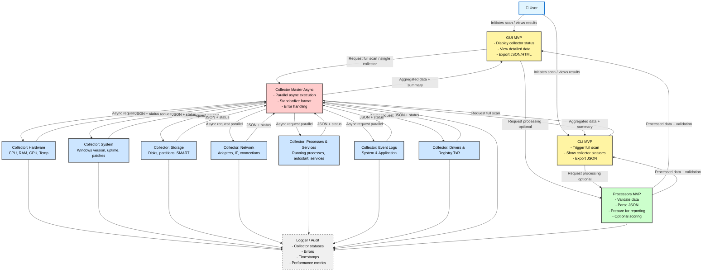

# Diagnostic Tool - MVP (IN-PROGRESS)

Narzędzie diagnostyczne systemu Windows do zbierania i prezentacji danych diagnostycznych w sposób spójny, czytelny i łatwy do przetworzenia przez dalsze moduły analityczne.

## 📊 Architecture Flow

Aplikacja używa modularnej architektury z pełną asynchronicznością:



**Więcej informacji:**
- 📐 [PlantUML Diagram](docs/MVP_PIPELINE_FLOW.puml) - Dla edycji i zaawansowanych narzędzi
- 📖 [Architecture Documentation](docs/MVP_ARCHITECTURE.md) - Pełna dokumentacja architektury
- 🔄 [Async & Testing](docs/ASYNC_AND_TESTING.md) - Dokumentacja asynchroniczności i testów

### 🔄 Aktualizacja Diagramu Flow

Diagram flow jest automatycznie aktualizowany na podstawie struktury aplikacji.

**Aktualizacja diagramu:**
```bash
python scripts/update_flow_diagram.py
```

Skrypt analizuje:
- Collectory z `core/collector_registry.py`
- Procesory z `core/processor_registry.py`
- Konfigurację z `config.json`

I automatycznie aktualizuje diagram PlantUML i dokumentację.

**Jak wyświetlić diagram PlantUML:**
1. Online: http://www.plantuml.com/plantuml/uml/ (wklej zawartość pliku `.puml`)
2. VS Code: Zainstaluj rozszerzenie "PlantUML" i naciśnij `Alt+D`
3. IntelliJ/PyCharm: Zainstaluj wtyczkę "PlantUML integration"

## Cel MVP

Zebrać i zaprezentować dane diagnostyczne Windows w sposób spójny, czytelny i łatwy do przetworzenia przez dalsze moduły analityczne.

## Funkcje MVP

### Collectory (dane źródłowe)
- **Hardware**: CPU, RAM, dyski, GPU, temperatura, wykorzystanie zasobów
- **System**: wersja Windows, uptime, aktualizacje, patch level
- **Procesy i usługi**: uruchomione procesy, autostart, status usług
- **Logi systemowe**: wybrane Event Logi (System, Application)
- **Storage**: dostępne dyski, partycje, wolne miejsce, SMART dysków
- **Sieć**: konfiguracja adapterów, IP, status połączeń
- **Drivers**: informacje o sterownikach, status, wersje
- **Registry TxR**: błędy transakcji rejestru
- **BSOD/Dumps**: analiza zrzutów pamięci
- **Performance Counters**: liczniki wydajności systemu
- **WER**: Windows Error Reporting - raporty crashy aplikacji
- **Processes**: szczegółowe informacje o procesach

### Procesory (MVP - wersja minimalna)
- **Parser danych**: konwersja na wewnętrzny format JSON
- **Walidacja danych**: sprawdzanie poprawności typów i wartości
- **Status**: "Collected" / "Error" dla każdego collectora

### GUI MVP
- **Lista collectorów**: wyświetlanie statusu każdego collectora (Collected / Error)
- **Podgląd surowych danych**: czytelna tabela lub drzewo danych
- **Eksport raportu**: JSON/HTML w łatwej do przetworzenia formie

### CLI MVP (opcjonalnie)
- **Pełne skanowanie**: uruchomienie wszystkich collectorów
- **Status collectorów**: wyświetlanie statusu w konsoli

## Instalacja

```bash
pip install -r requirements.txt
```

## 📝 Logowanie

Program automatycznie loguje wszystkie operacje do pliku `logs/diagnostic_tool_YYYYMMDD.log`:
- Start/zakończenie collectors i processors
- Błędy i wyjątki z pełnym tracebackiem
- Metryki wydajności (czas wykonania operacji)
- Informacje o analizie BSOD
- Problemy z kodowaniem i subprocessami

Logi są pomocne przy debugowaniu problemów i analizie wydajności.

## ⚠️ Wymagane uprawnienia

**Program wymaga uprawnień administratora** do:
- Czytania logów systemowych Windows
- Dostępu do Registry TxR errors
- Sprawdzania statusu usług systemowych
- Analizy BSOD i memory dumps

### Jak uruchomić jako administrator:

**Windows:**
1. Kliknij prawym przyciskiem na plik `.py` lub skrót
2. Wybierz **"Uruchom jako administrator"**

**Lub przez PowerShell (jako administrator):**
```powershell
python gui.py
python main.py
```

## Użycie

### GUI (Interfejs graficzny)
```bash
python gui.py
```

### CLI (Wiersz poleceń)
```bash
# Pełne skanowanie
python main.py

# Lub przez orchestrator
python cli.py --full
```

## Architektura i Flow

### Diagram Pipeline Flow

Aplikacja używa modularnej architektury z następującym flow:

```
User → GUI MVP → Collector Master → Collectors (parallel) → Collector Master → GUI MVP
                                                              ↓
                                                         Processors MVP → GUI MVP
```

**Wizualizacja:**
- 📊 [Mermaid Diagram](docs/MVP_PIPELINE_FLOW.md) - Renderowany automatycznie w GitHub
- 📐 [PlantUML Diagram](docs/MVP_PIPELINE_FLOW.puml) - Dla edycji i zaawansowanych narzędzi
- 📖 [Architecture Documentation](docs/MVP_ARCHITECTURE.md) - Pełna dokumentacja architektury

**Jak wyświetlić diagram PlantUML:**
1. Online: http://www.plantuml.com/plantuml/uml/ (wklej zawartość pliku `.puml`)
2. VS Code: Zainstaluj rozszerzenie "PlantUML" i naciśnij `Alt+D`
3. IntelliJ/PyCharm: Zainstaluj wtyczkę "PlantUML integration"

## Struktura projektu

```
/diagnostic_tool/
├── collectors/          # Moduły zbierające dane
│   ├── hardware.py
│   ├── drivers.py
│   ├── system_logs.py
│   ├── registry_txr.py
│   ├── storage_health.py
│   ├── system_info.py
│   ├── services.py
│   ├── bsod_dumps.py
│   ├── performance_counters.py
│   ├── wer.py
│   ├── processes.py
│   ├── base_collector.py  # Klasa bazowa dla collectorów
│   └── collector_master.py  # Orchestrator collectorów
├── processors/         # Moduły przetwarzające dane (MVP - minimalna wersja)
│   ├── analyzer.py    # Główny analyzer
│   ├── base_processor.py  # Bazowy processor MVP
│   ├── hardware_processor.py
│   ├── driver_processor.py
│   ├── system_logs_processor.py
│   ├── registry_txr_processor.py
│   ├── storage_health_processor.py
│   ├── system_info_processor.py
│   └── ... (inne procesory)
├── core/              # Moduły core (MVP)
│   ├── config_loader.py  # Loader konfiguracji
│   ├── collector_registry.py  # Rejestr collectorów
│   └── processor_registry.py  # Rejestr procesorów
├── docs/              # Dokumentacja
│   ├── MVP_PIPELINE_FLOW.md  # Diagram flow (Mermaid)
│   ├── MVP_PIPELINE_FLOW.puml  # Diagram flow (PlantUML)
│   └── MVP_ARCHITECTURE.md  # Dokumentacja architektury
├── output/             # Wygenerowane raporty
│   ├── raw/           # Surowe dane z collectorów
│   └── processed/     # Przetworzone raporty
├── config.json        # Plik konfiguracyjny
├── gui_mvp.py        # Interfejs graficzny MVP
├── gui.py             # Interfejs graficzny (stary)
├── main.py            # CLI entry point (MVP)
└── cli.py             # CLI orchestrator
```

## Format danych MVP

### Format zwracany przez Collector
Każdy collector zwraca standardowy format:
```json
{
    "status": "Collected" | "Error",
    "data": {
        // Dane specyficzne dla collectora
    },
    "error": null | "error message",
    "timestamp": "2025-11-30T12:00:00",
    "collector_name": "hardware",
    "execution_time_ms": 1234
}
```

### Format zwracany przez Processor
Każdy processor zwraca standardowy format:
```json
{
    "status": "Collected" | "Error",
    "data": {
        // Przetworzone dane
    },
    "errors": [],
    "warnings": [],
    "validation_passed": true,
    "timestamp": "2025-11-30T12:00:00",
    "processor_name": "hardware_processor"
}
```

### Statusy Collectorów
- **Collected**: Dane zostały pomyślnie zebrane
- **Error**: Wystąpił błąd podczas zbierania danych

## Statusy i walidacja

### Statusy Collectorów
- ✅ **Collected**: Dane zostały pomyślnie zebrane
- ❌ **Error**: Wystąpił błąd podczas zbierania danych

### Statusy Procesorów
- ✅ **Collected**: Dane zostały pomyślnie przetworzone
- ❌ **Error**: Wystąpił błąd podczas przetwarzania danych
- ⚠️ **Warnings**: Dane przetworzone, ale z ostrzeżeniami

### Walidacja danych
Każdy processor wykonuje minimalną walidację:
- Sprawdzenie poprawności typów wartości
- Sprawdzenie obecności wymaganych pól
- Wykrywanie błędów w strukturze danych

## Wymagania

- Windows 10/11
- Python 3.7+
- Wymagane biblioteki w `requirements.txt`

## Licencja

Zobacz plik LICENSE.
