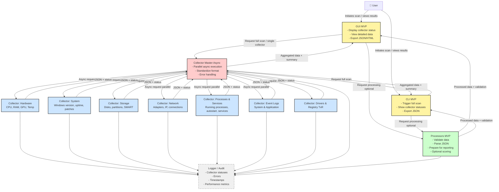

# Diagnostic Tool MVP - Pipeline Flow

## Diagram Flow

### PlantUML Version

Diagram w formacie PlantUML można wyświetlić na kilka sposobów:

1. **Online Viewer (PlantUML):**
   - Skopiuj zawartość pliku `MVP_PIPELINE_FLOW.puml`
   - Wklej na: http://www.plantuml.com/plantuml/uml/
   - Lub użyj: https://www.planttext.com/

2. **VS Code:**
   - Zainstaluj rozszerzenie "PlantUML" (jebbs.plantuml)
   - Otwórz plik `.puml` i naciśnij `Alt+D` aby wyświetlić podgląd

3. **IntelliJ/PyCharm:**
   - Zainstaluj wtyczkę "PlantUML integration"
   - Otwórz plik `.puml` i użyj podglądu

### Mermaid Version (Renderowany w GitHub)

Poniższy diagram jest renderowany automatycznie w GitHub:



## Opis Flow

### 1. Full Scan Flow

1. **User** inicjuje skan przez GUI MVP
2. **GUI MVP** wysyła żądanie do Collector Master
3. **Collector Master** uruchamia wszystkie collectory równolegle
4. **Collectors** zbierają dane i zwracają w standardowym formacie
5. **Collector Master** agreguje dane i zwraca do GUI MVP
6. **GUI MVP** opcjonalnie wysyła dane do Processors MVP
7. **Processors MVP** waliduje i przetwarza dane
8. **GUI MVP** wyświetla wyniki użytkownikowi

### 2. Single Collector Flow

1. **User** wybiera pojedynczy collector w GUI MVP
2. **GUI MVP** bezpośrednio wywołuje collector (lub przez Collector Master)
3. **Collector** zwraca dane w standardowym formacie
4. **GUI MVP** wyświetla dane użytkownikowi

## Format Danych

### Collector Output Format

```json
{
    "status": "Collected" | "Error",
    "data": {...},
    "error": null | "error message",
    "timestamp": "ISO timestamp",
    "collector_name": "hardware",
    "execution_time_ms": 1234
}
```

### Processor Output Format

```json
{
    "status": "Collected" | "Error",
    "data": {...},
    "errors": [],
    "warnings": [],
    "validation_passed": true,
    "timestamp": "ISO timestamp",
    "processor_name": "hardware_processor"
}
```

## Zobacz też

- [MVP Architecture Documentation](MVP_ARCHITECTURE.md)
- [MVP Refactoring Plan](../MVP_REFACTORING_PLAN.md)

